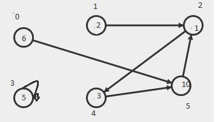
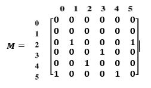
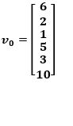

# ClassicalToQuantum simulation

En este programa se realizo la implementacion sobre los diferentes experimentos sobre sistemas,como :

* Expermiento del sistema determinista cuyo valor de lascanicas son de tipo Booleanos

* Experimentos de las multiples rendijas clasico probabilistico, con mas de dos rendijas.

* Expermiento de las multiples rendijas cuantico.

de manera adicional,la libreria poseera una funcion que sera capaz de graficar con un diagrama de barras las probabilidades de un vector de estados de un sistema.

## Autor
* Andres Felipe Davila Gutierrez

## Inicio 

* Antes de empezar se debe tener en cuentalaforma en que los sistemas van a ser representados, cada sistematendra una matriz de adyacencia asociada y un vector el cualrepresentara el estado inicial del sistema, donde sus posiciones representaran elpeso de una conexion especifica entre componentes del sistema, a continuacion se va a mostrar un ejemplo de un sistema deterministico.

## Sistema



## Matriz asociada al sistema 



## Estado inicial del sistema





## Representacion en la libreria 

* Representacion de la matriz en la libreria corresponde a :

```
M = [   [ [0, 0], [0, 0] , [0, 0] ,[0, 0] ,[0, 0]    ],
             [  [0, 0], [0, 0] , [0, 0] ,[0, 0] ,[0, 0]  ],
	     [  [0, 0], [1, 0] , [0, 0] ,[0, 0] ,[1, 0]   ],
	     [  [0, 0], [0, 0] , [0, 0] ,[0, 0] ,[0, 0]  ],
	     [  [0, 0], [0, 0] , [1, 0] ,[0, 0] ,[0, 0] ],
	     [  [1, 0], [0, 0] , [0, 0] ,[1, 0] ,[0, 0]   ]]

```
* Representacion del vector en la libreria corresponde a :

```
v0 = [ [6, 0],
 	   [2, 0],
	   [1, 0],
	   [5, 0] ,
	   [3, 0] ,
	   [10, 0]]
```

## Pre-requisitos

* Tener instalado python 3 o una version mayor

* Tener instaladas las librerias numpy, scipy y matplotlib - python 

## Ejecutando el programa
Para ejecutar el programa se deben seguir los siquientes pasos:

1. Descargar el repositorio en git usando el comando git clone
```
git clone https://github.com/AndresDa1302/SimulacionCnyt.git

```

2. Abrir  donde fue guardadado el archivo y ejecutar el siguiente comando:

```
python classicalToQuantum.py

```
## Pruebas del programa

A continuacion podremos visualizar el set depruebas que se pdoran encontrar en el archivo classicalToQuantumTest.py.

* Primer prueba: Prueba asociada al experimentos #1, la cual dada una matriz de elementos booleanos y un vector de estado inicial de un sistema deterministico, calcula el estado final que este se encontrara dado un numero de veces que este cambiara.

* Segunda prueba: Prueba asociada al experimento #2, la cual dada una matriz de elementos que representa una probabilidad y un vector de estado inicial de un sistema probabilistico ( ** experimento de las multiples rendijas ** ), calcula el estado final que este se encontrara dado un numero de veces que este cambiara

* Tercera prueba: Prueba asociada al experimento #3, la cual dada una matriz de elementos de numeros imaginarios y un vector de estado inicial de un sistema probabilistico cuantico ( ** experimento de las multiples rendijas ** ), calcula el estado final que este se encontrara dado un numero de veces que este cambiara.

* Cuarta prueba: Prueba asociada a la funcion #4, la cual dado un vector de estado de un sistema probabilistico, logre graficar la probabilidad en cada uno de los estados.


## Ejecutando pruebas

Para ejecutar las pruebas se deben seguir los siquientes pasos:


1. Descargar el repositorio en git usando el comando git clone
```
git clone https://github.com/AndresDa1302/SimulacionCnyt.git

```

2. Abrir  donde fue guardadado el archivo y ejecutar el siguiente comando:

```
python classicalToQuantumTest.py

```